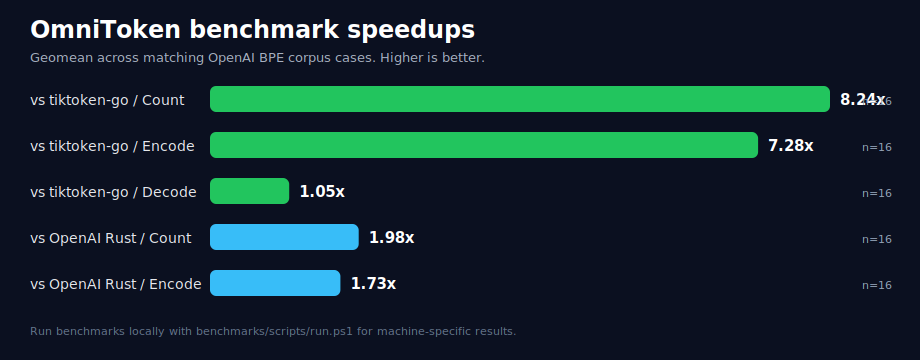

<p align="center">
  <h1 align="center">OmniToken</h1>
</p>

<p align="center">
  Pure-Go LLM tokenizer library for local token counting, encoding, and decoding with OpenAI-compatible BPE, custom vocabularies, and provider adapters.
</p>

<p align="center">
  <a href="https://pkg.go.dev/github.com/ron2111/omnitoken"></a>
  <a href="./LICENSE"></a>
  
  
  
</p>

OmniToken is built for Go services that need fast local token accounting for prompt sizing, context-window planning, tokenizer experiments, and cache-boundary analysis without CGO, Rust, or Python runtime dependencies in the root module.

## Features

- Pure Go tokenizer library for LLM applications.
- OpenAI-compatible BPE token counting for `cl100k_base`, `o200k_base`, and `o200k_harmony`.
- Local `CountTokens`, `EncodeOrdinary`, and `Decode` APIs.
- Zero-allocation `CountTokens` hot path for supported OpenAI BPE workloads.
- Custom WordPiece and SentencePiece-style vocabularies.
- Prompt-cache alignment planner for token block-boundary analysis.
- Optional adapter modules for Gemini, Llama 3, Mistral, Hugging Face `tokenizer.json`, OSS SentencePiece models, and Anthropic message token counting.

## Benchmarks

Measured on Windows 11 amd64, Intel i7-1250U, Go 1.24.2. See the [full benchmark report](./benchmarks/baselines/i7-1250u-2026-07-05/summary.md) or regenerate it with [`benchmarks/`](./benchmarks/README.md).



| Comparison | Geomean result |
| --- | ---: |
| OmniToken `CountTokens` vs `tiktoken-go` | 15.84x faster |
| OmniToken `EncodeOrdinary` vs `tiktoken-go` | 13.09x faster |
| OmniToken `Decode` vs `tiktoken-go` | 2.29x faster |
| OmniToken `CountTokens` vs OpenAI Rust `tiktoken` | 0.96x, near parity |
| OmniToken `EncodeOrdinary` vs OpenAI Rust `tiktoken` | 0.75x, competitive pure Go |

| Operation | Encoding | Input | ns/op | B/op | allocs/op |
| --- | --- | --- | ---: | ---: | ---: |
| `CountTokens` | `cl100k_base` | JSON | 1,517 | 0 | 0 |
| `EncodeOrdinary` | `cl100k_base` | JSON | 1,661 | 288 | 1 |
| `CountTokens` | `o200k_base` | JSON | 2,152 | 0 | 0 |
| `EncodeOrdinary` | `o200k_base` | JSON | 1,835 | 288 | 1 |

## Install

```powershell
go get github.com/ron2111/omnitoken
```

## Quick Start

```go
package main

import (
	"fmt"

	"github.com/ron2111/omnitoken"
)

func main() {
	engine, err := omnitoken.ForModel("gpt-4o")
	if err != nil {
		panic(err)
	}

	tokens := engine.EncodeOrdinary("hello world")
	count := engine.CountTokens("hello world")
	text := engine.Decode(tokens)

	fmt.Println(count, text)
}
```

## Support

| Family | Status |
| --- | --- |
| OpenAI `cl100k_base` | Supported |
| OpenAI `o200k_base` | Supported |
| OpenAI `o200k_harmony` | Supported |
| WordPiece local vocabularies | Supported |
| SentencePiece-style local vocabularies | Supported |
| Gemini local text adapter | Optional module |
| OSS SentencePiece adapter | Optional module |
| Llama 3 tiktoken-BPE adapter | Optional module |
| Mistral Tekken adapter | Optional module |
| Hugging Face WordPiece adapter | Optional module |
| Anthropic message counter | Optional module |

## Cache Alignment

```go
engine, err := omnitoken.ForModel("gpt-4o")
if err != nil {
	panic(err)
}

report := omnitoken.NewCacheAligner(engine).AlignPromptToProfile(
	systemPrompt,
	omnitoken.CacheProfileOpenAI,
)
```

Cache alignment is informational: OmniToken does not edit prompts automatically. See [cache alignment](./docs/cache.md).

## Custom Models

```go
err := omnitoken.RegisterEncoding("my_wordpiece", func() (omnitoken.ModelEngine, error) {
	return omnitoken.NewWordPiece(vocabBytes, omnitoken.WordPieceOptions{Lowercase: true})
})
if err != nil {
	panic(err)
}

err = omnitoken.RegisterModelPrefix("my-model-", "my_wordpiece")
```

## More

- [Architecture](./docs/architecture.md)
- [Benchmarks and correctness](./docs/benchmarks.md)
- [Cache alignment](./docs/cache.md)
- [Adapters](./adapters/README.md)

## Future Scope

- Streaming token counting through the public API.
- More provider adapters with verified local vocab sources.
- Release CI for benchmark regression tracking.

## License

MIT License. See [LICENSE](./LICENSE).
