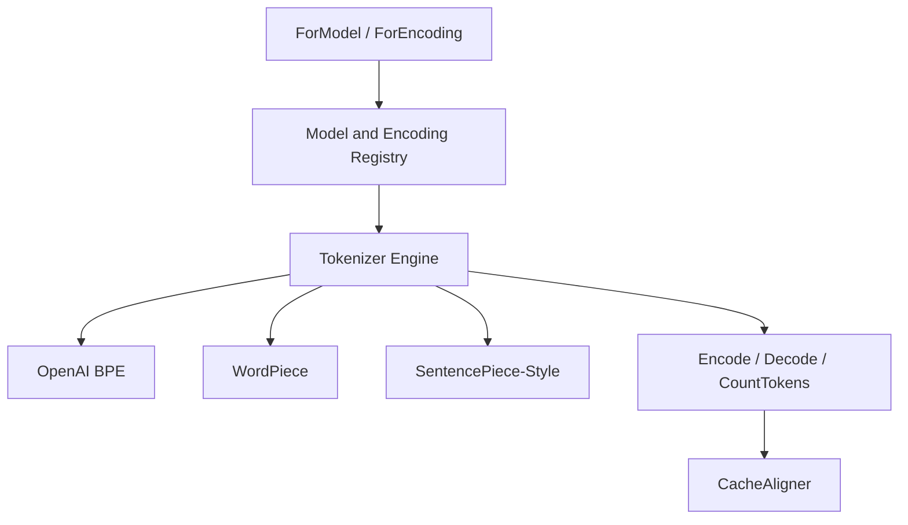

# Architecture

OmniToken separates model lookup, text segmentation, and vocabulary lookup so different tokenizer families can share one public API.

## Registry

- `ForModel` resolves model names to encodings.
- `ForEncoding` resolves encodings to cached tokenizer engines.
- `RegisterEncoding` adds custom tokenizer engines.
- `RegisterModel` and `RegisterModelPrefix` map local model names to custom encodings.
- `ResolveModel` returns provider and encoding metadata without constructing a new API client.

## Engines

| Engine | Input | Notes |
| --- | --- | --- |
| OpenAI BPE | Embedded `.tiktoken` assets | Regex-free scanner and pure-Go BPE merge loop. |
| WordPiece | Newline vocabulary | Greedy longest-match tokenization with configurable continuation prefix. |
| SentencePiece-style | Newline metaspace vocabulary | Greedy longest-match tokenization with configurable metaspace marker. |

The main module does not pull in external runtime dependencies.
